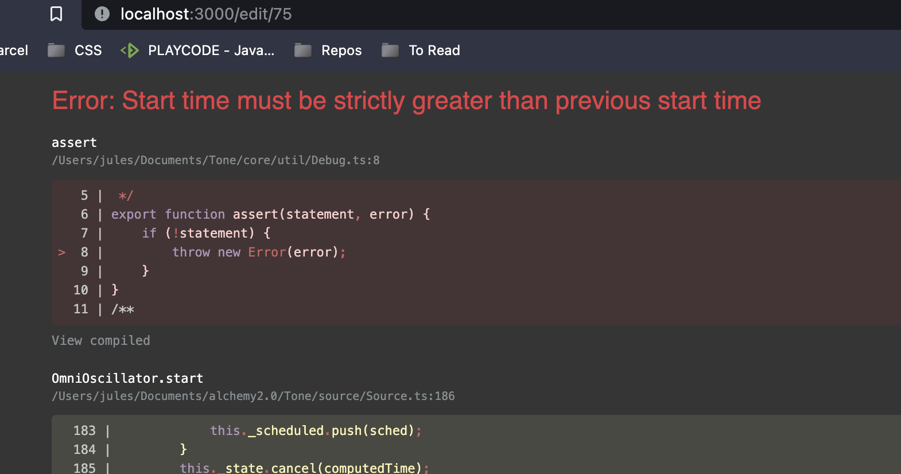

# Type Tune

Such a great app - from the colors to the choices you made with tune.js, its just really brings a lot of joy. Great work. Here are a few notes from going through the code but they're nitpicky -- overall its all really clean, and easy to understand. Great job!

- There's an interesting bug when you hit "playback" again while a tune is playing -- it seems to get itself confused about start times -- you should add a check to either ignore the click if something is already playing or stop playing the existing tune and start over
  
- A loading state would be nice on the edit page so you don't have the form flash the placeholder text then show the actual content
- It would be fun to have a toggle where you could either hear the tones as you're typing or just have the playback option (its kinda fun to be surprised by what a sentence sounds like)
- Don't forget to consider error states
- I think you could pretty quickly get some responsive CSS in there so this looks okay on mobile. Also I would remove the default Chrome blue outline on the inputs -- its kind of jarring against your awesome primary pallete
- I think you maybe overthought the "savedstring" issue - as long as your user doesn't refresh the page and you don't reset the state - it _should_ still be in context when they come back to the create page after signing in
- There's a little bit of a weird edge case where if you logout when you're on the edit page, you end up at the home page but with the wrong buttons on the form
